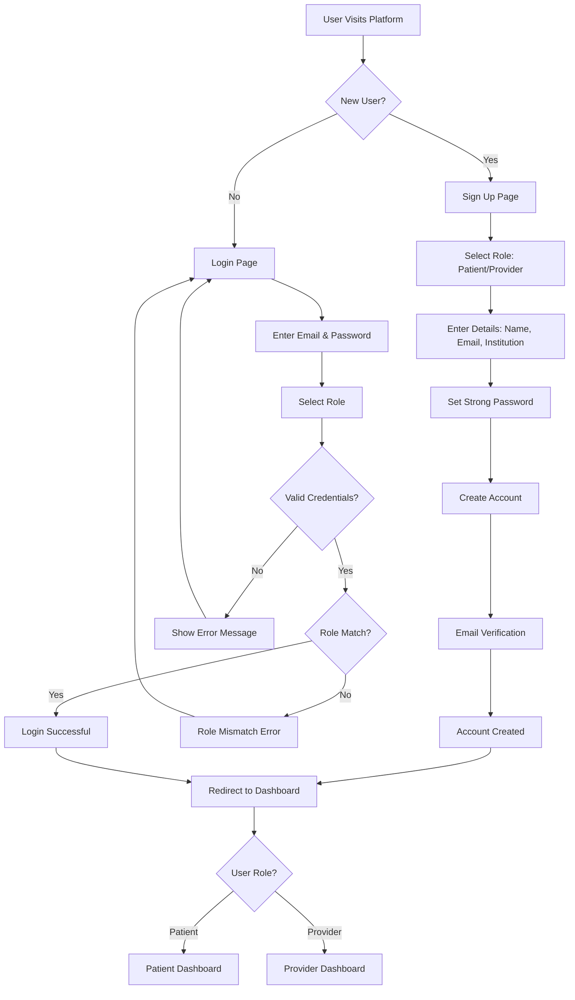
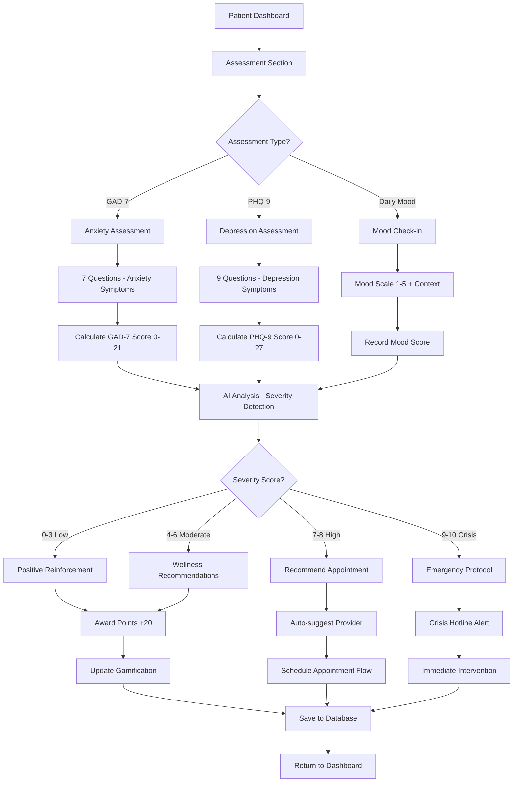
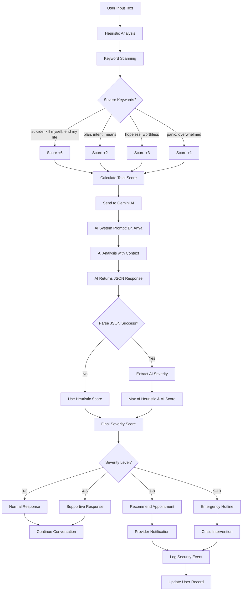
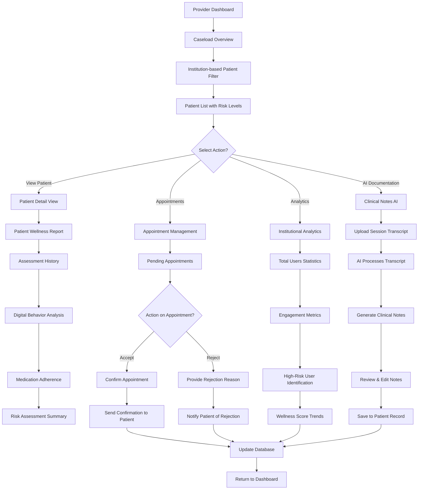
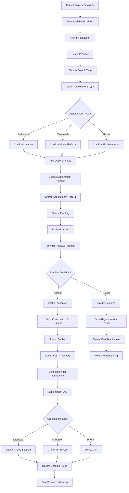
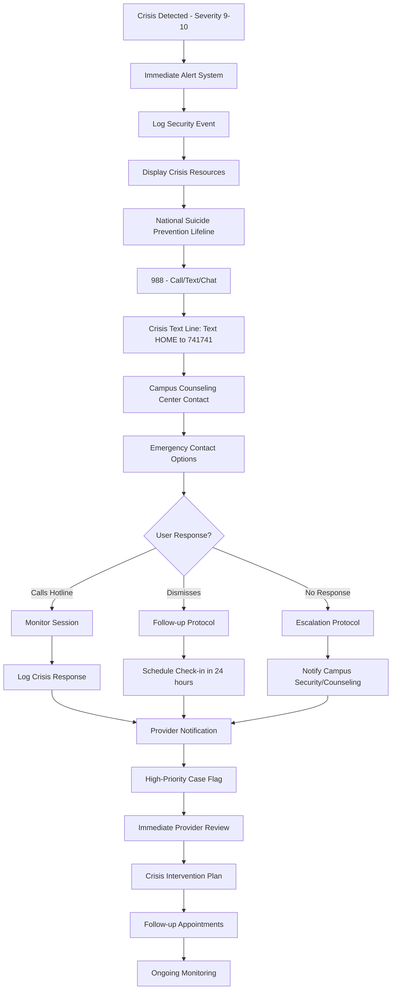

# MindFull Horizon - Process Flow Diagram

## 1. User Registration & Authentication Flow



## 2. Patient Journey - Mental Health Assessment Flow



## 3. AI-Powered Crisis Detection Flow



## 4. Provider Workflow - Patient Management Flow



## 5. Gamification & Engagement Flow

```mermaid
flowchart TD
    A[User Completes Activity] --> B{Activity Type?}
    
    B -->|Assessment| C[Award 20 Points]
    B -->|Digital Detox Log| D[Award 15 Points]
    B -->|Medication Log| E[Award 10 Points]
    B -->|Breathing Exercise| F[Award 20 Points]
    B -->|Yoga Session| G[Award 20 Points]
    B -->|Journal Entry| H[Award 15 Points]
    
    C --> I[Update Gamification Record]
    D --> I
    E --> I
    F --> I
    G --> I
    H --> I
    
    I --> J[Check Last Activity Date]
    J --> K{Consecutive Day?}
    K -->|Yes| L[Increment Streak +1]
    K -->|No| M[Reset Streak to 1]
    
    L --> N[Update Total Points]
    M --> N
    N --> O[Check Badge Criteria]
    
    O --> P{Milestone Reached?}
    P -->|First Assessment| Q[Award "Getting Started" Badge]
    P -->|7-Day Streak| R[Award "Consistent" Badge]
    P -->|100 Points| S[Award "Achiever" Badge]
    P -->|30-Day Streak| T[Award "Dedicated" Badge]
    
    Q --> U[Add Badge to Profile]
    R --> U
    S --> U
    T --> U
    P -->|No Milestone| V[Continue]
    
    U --> W[Show Achievement Notification]
    V --> X[Update Dashboard Display]
    W --> X
    X --> Y[Save to Database]
```

## 6. Appointment Scheduling Flow



## 7. Digital Detox & Wellness Tracking Flow

```mermaid
flowchart TD
    A[Patient Accesses Digital Detox] --> B[Input Screen Time Hours]
    B --> C[Rate Academic Performance 1-10]
    C --> D[Rate Social Interactions 1-10]
    D --> E[Submit Daily Log]
    
    E --> F[Calculate Correlation Scores]
    F --> G[Screen Time vs Academic Performance]
    G --> H[Screen Time vs Social Health]
    H --> I[Generate AI Insights]
    
    I --> J{Screen Time Analysis?}
    J -->|>8 hours| K[High Risk - Needs Improvement]
    J -->|6-8 hours| L[Moderate - Good Progress]
    J -->|<6 hours| M[Low Risk - Excellent]
    
    K --> N[Suggest Digital Detox Activities]
    L --> O[Encourage Current Habits]
    M --> P[Positive Reinforcement]
    
    N --> Q[Recommend: Phone-free study time]
    N --> R[Recommend: Outdoor activities]
    N --> S[Recommend: Social meetups]
    
    O --> T[Maintain balance tips]
    P --> U[Keep up great work]
    
    Q --> V[Award Engagement Points]
    R --> V
    S --> V
    T --> V
    U --> V
    
    V --> W[Update Wellness Dashboard]
    W --> X[Generate Weekly Report]
    X --> Y[Share with Provider (if consented)]
    Y --> Z[Save to Database]
```

## 8. Emergency Crisis Intervention Flow



## 9. Data Flow & AI Processing Pipeline

```mermaid
flowchart TD
    A[User Input Data] --> B[Input Validation & Sanitization]
    B --> C[Store in PostgreSQL Database]
    C --> D[Trigger AI Analysis]
    
    D --> E{Data Type?}
    E -->|Text/Chat| F[Sentiment Analysis]
    E -->|Assessment| G[Score Calculation]
    E -->|Voice Log| H[Emotion Detection]
    E -->|Journal Entry| I[Insight Generation]
    
    F --> J[Gemini API Call]
    G --> J
    H --> J
    I --> J
    
    J --> K[AI Processing with System Prompts]
    K --> L[JSON Response Parsing]
    L --> M{Valid Response?}
    
    M -->|No| N[Use Fallback Logic]
    M -->|Yes| O[Extract AI Insights]
    
    N --> P[Heuristic Analysis]
    O --> Q[Combine with Heuristic Score]
    P --> Q
    
    Q --> R[Generate Recommendations]
    R --> S[Update User Dashboard]
    S --> T[Provider Notifications (if needed)]
    T --> U[Gamification Updates]
    U --> V[Database Commit]
    
    V --> W[Real-time Dashboard Update]
    W --> X[Analytics Pipeline]
    X --> Y[Institutional Reporting]
```

## 10. System Architecture & Security Flow

```mermaid
flowchart TD
    A[User Request] --> B[Flask Application]
    B --> C[Authentication Check]
    C --> D{Authenticated?}
    
    D -->|No| E[Redirect to Login]
    D -->|Yes| F[Role-based Authorization]
    
    F --> G{Authorized?}
    G -->|No| H[Access Denied - 403]
    G -->|Yes| I[CSRF Token Validation]
    
    I --> J[Input Sanitization]
    J --> K[Rate Limiting Check]
    K --> L[Business Logic Processing]
    
    L --> M[Database Operations]
    M --> N[AI Service Calls (if needed)]
    N --> O[Response Generation]
    
    O --> P[Security Headers]
    P --> Q[Session Management]
    Q --> R[Audit Logging]
    R --> S[Return Response]
    
    E --> T[Login Flow]
    H --> U[Error Logging]
    S --> V[Client Receives Response]
```

This comprehensive process flow diagram covers all major user journeys and system processes in your MindFull Horizon platform, from user registration through crisis intervention and data processing pipelines.