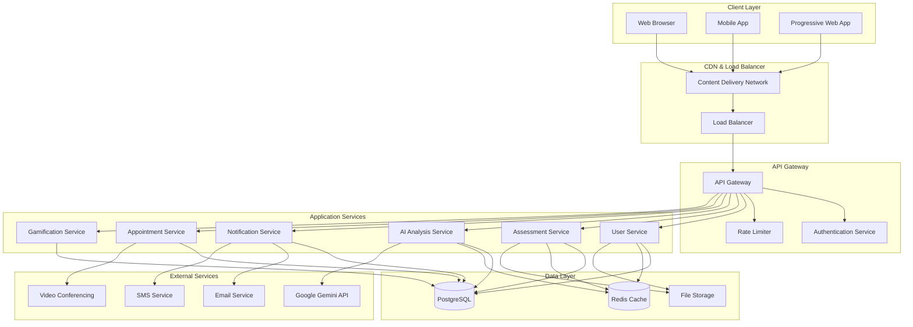
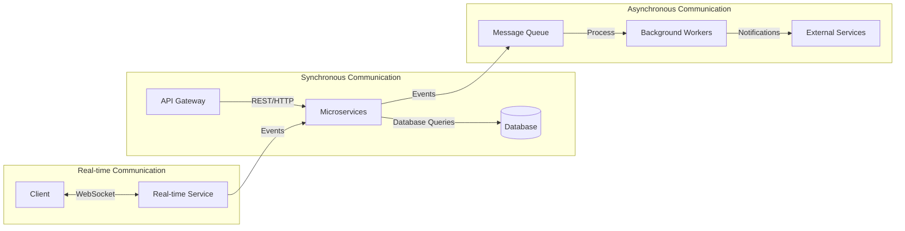
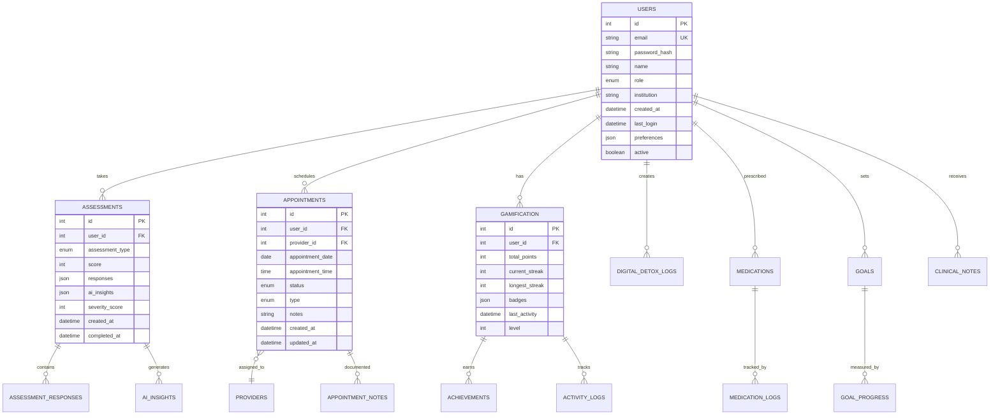
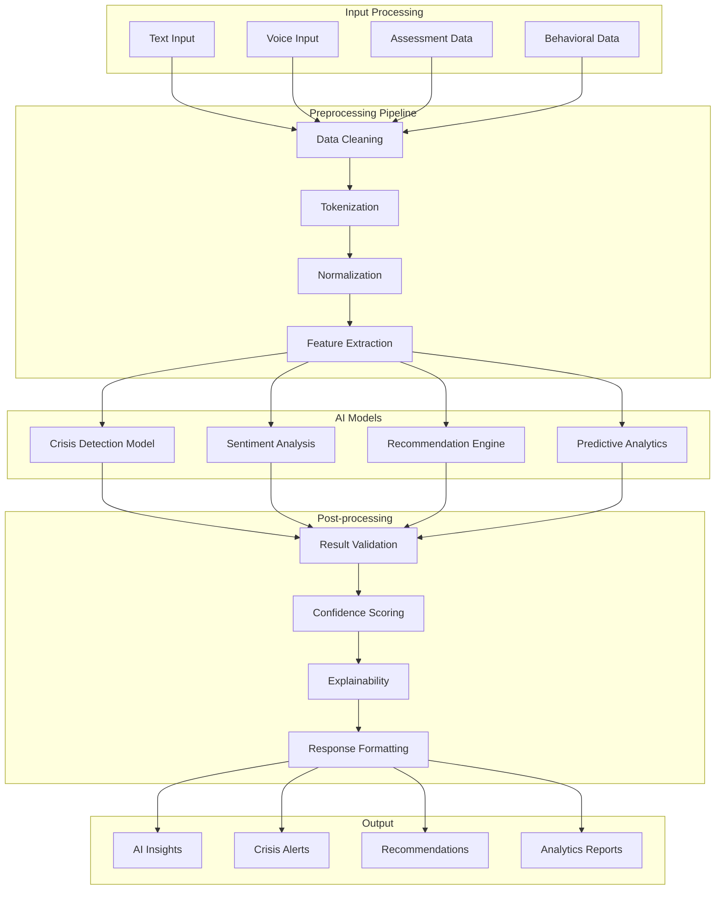
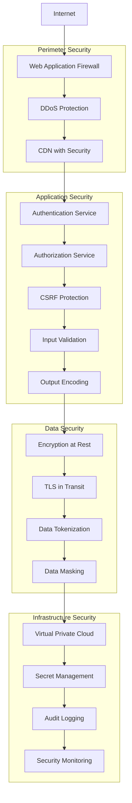
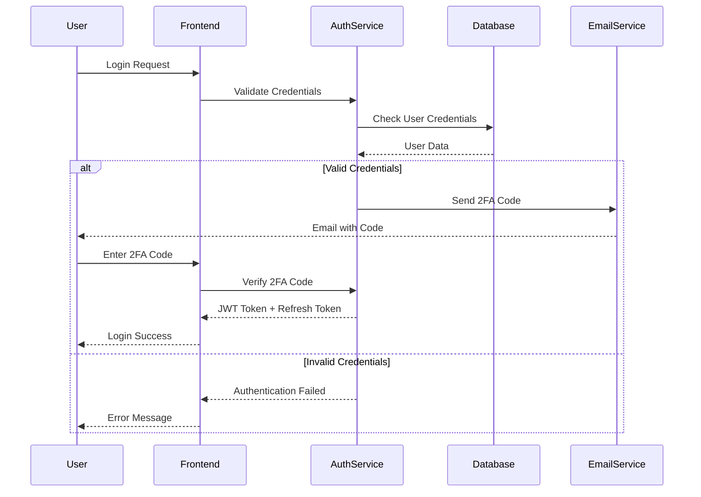
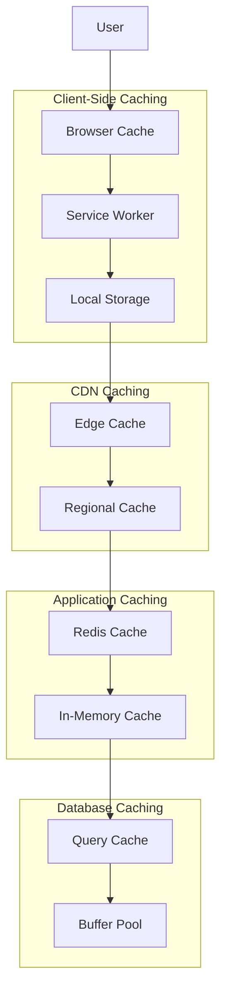
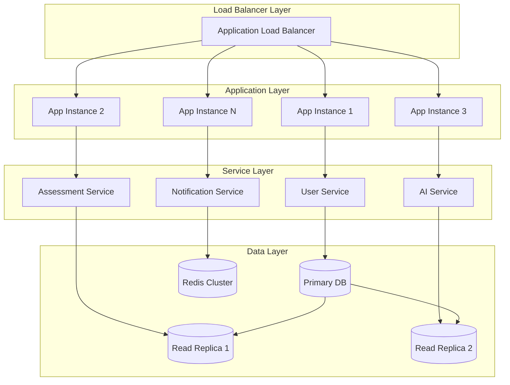
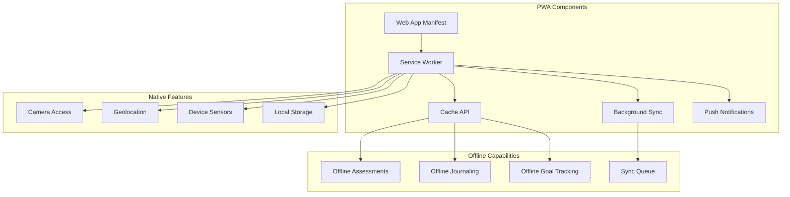
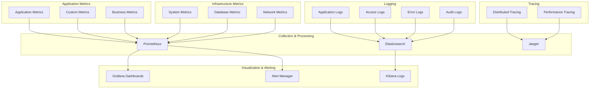

# MindFull Horizon - System Design Document

## 📋 Document Information

**Project Name:** MindFull Horizon - Dynamic Mental Health Assessment System  
**Version:** 1.0  
**Document Date:** January 2026  
**Design Phase:** Detailed System Design  
**Target Audience:** Development Team, Architects, Stakeholders  

## 🎯 Design Overview

### 1. System Vision
MindFull Horizon is designed as a cloud-native, microservices-based mental health platform that provides real-time psychological assessment and intervention capabilities. The system emphasizes scalability, security, and user engagement through gamification and AI-powered insights.

### 2. Design Principles
- **Security First**: HIPAA-compliant architecture with defense-in-depth
- **User-Centric**: Intuitive interfaces optimized for student engagement
- **AI-Driven**: Machine learning at the core of assessment and intervention
- **Scalable**: Cloud-native design supporting institutional growth
- **Resilient**: Fault-tolerant with graceful degradation capabilities
- **Privacy-Preserving**: Data minimization and user consent management

## 🏗️ System Architecture

### 1. High-Level Architecture



### 2. Microservices Architecture

#### 2.1 Service Decomposition

**Core Services:**
- **User Management Service**: Authentication, authorization, profile management
- **Assessment Service**: Mental health assessments, scoring, history
- **AI Analysis Service**: Crisis detection, insights generation, recommendations
- **Gamification Service**: Points, streaks, badges, achievements
- **Appointment Service**: Scheduling, provider matching, calendar integration
- **Notification Service**: Email, SMS, push notifications, alerts
- **Analytics Service**: Reporting, dashboards, institutional metrics
- **File Management Service**: Document storage, media handling

**Supporting Services:**
- **API Gateway**: Request routing, authentication, rate limiting
- **Configuration Service**: Environment settings, feature flags
- **Audit Service**: Logging, compliance tracking, security events
- **Health Check Service**: Service monitoring, status reporting

#### 2.2 Service Communication Patterns



## 🎨 User Interface Design

### 1. Design System

#### 1.1 Visual Design Language
- **Color Palette**: Calming blues and greens with accessibility-compliant contrast ratios
- **Typography**: Inter font family for readability and modern appearance
- **Iconography**: Feather icons for consistency and clarity
- **Spacing**: 8px grid system for consistent layouts
- **Animations**: Subtle transitions for enhanced user experience

#### 1.2 Component Library
```
Design System Components:
├── Atoms
│   ├── Buttons (Primary, Secondary, Danger, Ghost)
│   ├── Input Fields (Text, Email, Password, Textarea)
│   ├── Labels and Typography
│   └── Icons and Avatars
├── Molecules
│   ├── Form Groups
│   ├── Navigation Items
│   ├── Card Components
│   └── Progress Indicators
├── Organisms
│   ├── Navigation Header
│   ├── Assessment Forms
│   ├── Dashboard Widgets
│   └── Data Tables
└── Templates
    ├── Dashboard Layouts
    ├── Form Layouts
    └── Content Layouts
```

### 2. User Interface Layouts

#### 2.1 Patient Dashboard Design

```
┌─────────────────────────────────────────────────────────────┐
│ Header: Logo | Navigation | Profile | Notifications        │
├─────────────────────────────────────────────────────────────┤
│ Welcome Section: Greeting | Streak Counter | Points        │
├─────────────────────────────────────────────────────────────┤
│ Quick Actions: Take Assessment | Schedule | Emergency       │
├─────────────────────────────────────────────────────────────┤
│ ┌─────────────────┐ ┌─────────────────┐ ┌─────────────────┐ │
│ │ Mood Tracker    │ │ Wellness Score  │ │ Recent Activity │ │
│ │ [Chart]         │ │ [Progress Ring] │ │ [Activity List] │ │
│ └─────────────────┘ └─────────────────┘ └─────────────────┘ │
├─────────────────────────────────────────────────────────────┤
│ ┌─────────────────┐ ┌─────────────────┐ ┌─────────────────┐ │
│ │ Appointments    │ │ Goals Progress  │ │ Achievements    │ │
│ │ [Calendar View] │ │ [Progress Bars] │ │ [Badge Grid]    │ │
│ └─────────────────┘ └─────────────────┘ └─────────────────┘ │
├─────────────────────────────────────────────────────────────┤
│ Footer: Resources | Privacy | Support                      │
└─────────────────────────────────────────────────────────────┘
```

#### 2.2 Provider Dashboard Design

```
┌─────────────────────────────────────────────────────────────┐
│ Header: Logo | Navigation | Institution | Profile          │
├─────────────────────────────────────────────────────────────┤
│ Analytics Overview: Total Patients | High Risk | Engagement│
├─────────────────────────────────────────────────────────────┤
│ ┌─────────────────────────────────────────────────────────┐ │
│ │ Patient Caseload                                        │ │
│ │ [Search/Filter] [Risk Level Filter] [Status Filter]    │ │
│ │ ┌─────┐ ┌─────────────┐ ┌──────────┐ ┌─────────────────┐ │ │
│ │ │Photo│ │Patient Name │ │Risk Level│ │Last Assessment  │ │ │
│ │ └─────┘ └─────────────┘ └──────────┘ └─────────────────┘ │ │
│ └─────────────────────────────────────────────────────────┘ │
├─────────────────────────────────────────────────────────────┤
│ ┌─────────────────┐ ┌─────────────────┐ ┌─────────────────┐ │
│ │ Pending Tasks   │ │ Appointments    │ │ Alerts & Flags  │ │
│ │ [Task List]     │ │ [Calendar View] │ │ [Alert List]    │ │
│ └─────────────────┘ └─────────────────┘ └─────────────────┘ │
└─────────────────────────────────────────────────────────────┘
```

### 3. Responsive Design Strategy

#### 3.1 Breakpoint System
```css
/* Mobile First Approach */
.container {
  /* Mobile: 320px - 767px */
  width: 100%;
  padding: 1rem;
}

@media (min-width: 768px) {
  /* Tablet: 768px - 1023px */
  .container {
    max-width: 768px;
    padding: 1.5rem;
  }
}

@media (min-width: 1024px) {
  /* Desktop: 1024px - 1439px */
  .container {
    max-width: 1024px;
    padding: 2rem;
  }
}

@media (min-width: 1440px) {
  /* Large Desktop: 1440px+ */
  .container {
    max-width: 1200px;
    padding: 2rem;
  }
}
```

#### 3.2 Mobile-Specific Features
- **Touch-Optimized**: Minimum 44px touch targets
- **Gesture Support**: Swipe navigation for assessments
- **Offline Capability**: Service worker for core functionality
- **Progressive Enhancement**: Feature detection and graceful degradation

## 🗄️ Database Design

### 1. Entity Relationship Diagram



### 2. Database Schema Design

#### 2.1 Core Tables

**Users Table**
```sql
CREATE TABLE users (
    id SERIAL PRIMARY KEY,
    email VARCHAR(255) UNIQUE NOT NULL,
    password_hash VARCHAR(255) NOT NULL,
    name VARCHAR(100) NOT NULL,
    role VARCHAR(20) NOT NULL CHECK (role IN ('patient', 'provider')),
    institution VARCHAR(100),
    profile_picture_url VARCHAR(500),
    google_id VARCHAR(100) UNIQUE,
    phone_number VARCHAR(20),
    date_of_birth DATE,
    gender VARCHAR(20),
    emergency_contact JSONB,
    preferences JSONB DEFAULT '{}',
    consent_given BOOLEAN DEFAULT FALSE,
    active BOOLEAN DEFAULT TRUE,
    created_at TIMESTAMP WITH TIME ZONE DEFAULT NOW(),
    updated_at TIMESTAMP WITH TIME ZONE DEFAULT NOW(),
    last_login TIMESTAMP WITH TIME ZONE
);

CREATE INDEX idx_users_email ON users(email);
CREATE INDEX idx_users_role_institution ON users(role, institution);
CREATE INDEX idx_users_active ON users(active);
```

**Assessments Table**
```sql
CREATE TABLE assessments (
    id SERIAL PRIMARY KEY,
    user_id INTEGER NOT NULL REFERENCES users(id) ON DELETE CASCADE,
    assessment_type VARCHAR(50) NOT NULL,
    score INTEGER NOT NULL,
    max_score INTEGER NOT NULL,
    responses JSONB NOT NULL,
    contextual_responses JSONB,
    ai_insights JSONB,
    severity_score INTEGER CHECK (severity_score BETWEEN 0 AND 10),
    recommended_action VARCHAR(50),
    provider_notified BOOLEAN DEFAULT FALSE,
    created_at TIMESTAMP WITH TIME ZONE DEFAULT NOW(),
    completed_at TIMESTAMP WITH TIME ZONE,
    
    CONSTRAINT valid_assessment_type 
        CHECK (assessment_type IN ('GAD-7', 'PHQ-9', 'Daily Mood', 'Custom'))
);

CREATE INDEX idx_assessments_user_id ON assessments(user_id);
CREATE INDEX idx_assessments_type_date ON assessments(assessment_type, created_at);
CREATE INDEX idx_assessments_severity ON assessments(severity_score);
```

#### 2.2 Performance Optimization

**Indexing Strategy**
```sql
-- Composite indexes for common queries
CREATE INDEX idx_assessments_user_type_date ON assessments(user_id, assessment_type, created_at DESC);
CREATE INDEX idx_appointments_provider_date ON appointments(provider_id, appointment_date, status);
CREATE INDEX idx_gamification_points ON gamification(total_points DESC);

-- Partial indexes for active records
CREATE INDEX idx_users_active_patients ON users(id) WHERE role = 'patient' AND active = TRUE;
CREATE INDEX idx_pending_appointments ON appointments(id) WHERE status = 'pending';

-- Full-text search indexes
CREATE INDEX idx_users_search ON users USING gin(to_tsvector('english', name || ' ' || email));
```

**Partitioning Strategy**
```sql
-- Partition assessments by date for better performance
CREATE TABLE assessments_2024 PARTITION OF assessments
    FOR VALUES FROM ('2024-01-01') TO ('2025-01-01');

CREATE TABLE assessments_2025 PARTITION OF assessments
    FOR VALUES FROM ('2025-01-01') TO ('2026-01-01');
```

### 3. Data Access Patterns

#### 3.1 Read Patterns
- **Patient Dashboard**: Recent assessments, gamification stats, upcoming appointments
- **Provider Caseload**: Patient list with risk levels, recent activity
- **Analytics Queries**: Aggregated data across time periods and user segments
- **Real-time Monitoring**: Crisis detection alerts, system health metrics

#### 3.2 Write Patterns
- **Assessment Submission**: High-frequency writes during peak usage
- **Activity Logging**: Continuous logging of user interactions
- **Gamification Updates**: Point awards, streak calculations, badge assignments
- **Audit Trail**: Security events, data access logs, system changes

## 🤖 AI/ML System Design

### 1. AI Architecture



### 2. Crisis Detection System

#### 2.1 Multi-Layer Detection Approach

**Layer 1: Heuristic Analysis**
```python
class HeuristicCrisisDetector:
    SEVERE_KEYWORDS = [
        'suicide', 'kill myself', 'end my life', 'want to die',
        'cut myself', 'self harm', 'hurt myself', 'no hope'
    ]
    
    HIGH_RISK_KEYWORDS = [
        'plan', 'intent', 'means', 'access to', 'tonight'
    ]
    
    def analyze(self, text: str) -> dict:
        score = 0
        triggers = []
        
        text_lower = text.lower()
        
        for keyword in self.SEVERE_KEYWORDS:
            if keyword in text_lower:
                score += 6
                triggers.append(keyword)
        
        for keyword in self.HIGH_RISK_KEYWORDS:
            if keyword in text_lower:
                score += 2
                triggers.append(keyword)
        
        return {
            'heuristic_score': min(10, score),
            'triggers': triggers,
            'confidence': 0.8 if score > 0 else 0.3
        }
```

**Layer 2: AI Analysis**
```python
class GeminiCrisisAnalyzer:
    def __init__(self):
        self.system_prompt = """
        You are Dr. Anya, a clinical psychologist specializing in crisis assessment.
        Analyze the following text for signs of mental health crisis.
        
        Respond with JSON only:
        {
            "severity": int (0-10),
            "risk_factors": ["list", "of", "factors"],
            "recommended_action": "none|monitor|appointment|emergency",
            "confidence": float (0.0-1.0),
            "reasoning": "brief explanation"
        }
        """
    
    async def analyze(self, text: str, context: dict = None) -> dict:
        try:
            response = await self.gemini_client.generate_content(
                prompt=f"{self.system_prompt}\n\nText to analyze: {text}",
                temperature=0.1,
                max_tokens=300
            )
            
            return self.parse_response(response.text)
        except Exception as e:
            logger.error(f"Gemini analysis failed: {e}")
            return self.fallback_analysis(text)
```

**Layer 3: Ensemble Decision**
```python
class EnsembleCrisisDetector:
    def __init__(self):
        self.heuristic_detector = HeuristicCrisisDetector()
        self.ai_analyzer = GeminiCrisisAnalyzer()
        self.weights = {'heuristic': 0.4, 'ai': 0.6}
    
    async def detect_crisis(self, text: str, user_context: dict) -> dict:
        # Get predictions from both layers
        heuristic_result = self.heuristic_detector.analyze(text)
        ai_result = await self.ai_analyzer.analyze(text, user_context)
        
        # Calculate weighted ensemble score
        final_score = (
            heuristic_result['heuristic_score'] * self.weights['heuristic'] +
            ai_result['severity'] * self.weights['ai']
        )
        
        # Determine action based on score and confidence
        action = self.determine_action(final_score, ai_result['confidence'])
        
        return {
            'severity_score': round(final_score, 1),
            'recommended_action': action,
            'heuristic_triggers': heuristic_result['triggers'],
            'ai_risk_factors': ai_result['risk_factors'],
            'confidence': ai_result['confidence'],
            'timestamp': datetime.utcnow().isoformat()
        }
```

### 3. Recommendation Engine

#### 3.1 Personalized Recommendations

```python
class PersonalizedRecommendationEngine:
    def __init__(self):
        self.activity_weights = {
            'breathing': {'anxiety': 0.8, 'stress': 0.9, 'depression': 0.4},
            'yoga': {'anxiety': 0.7, 'stress': 0.8, 'depression': 0.6},
            'music': {'anxiety': 0.6, 'stress': 0.5, 'depression': 0.8},
            'journaling': {'anxiety': 0.5, 'stress': 0.6, 'depression': 0.9}
        }
    
    def generate_recommendations(self, user_profile: dict, assessment_data: dict) -> list:
        recommendations = []
        
        # Analyze user's current state
        primary_concerns = self.identify_concerns(assessment_data)
        user_preferences = user_profile.get('preferences', {})
        past_activities = user_profile.get('activity_history', [])
        
        # Generate activity recommendations
        for activity, weights in self.activity_weights.items():
            score = sum(weights.get(concern, 0) for concern in primary_concerns)
            
            # Adjust for user preferences and past success
            if activity in user_preferences.get('preferred_activities', []):
                score *= 1.2
            
            if self.was_effective_previously(activity, past_activities):
                score *= 1.1
            
            recommendations.append({
                'activity': activity,
                'score': score,
                'reasoning': self.generate_reasoning(activity, primary_concerns)
            })
        
        # Sort by score and return top recommendations
        return sorted(recommendations, key=lambda x: x['score'], reverse=True)[:3]
```

## 🔒 Security Design

### 1. Security Architecture



### 2. Authentication & Authorization

#### 2.1 Multi-Factor Authentication Flow



#### 2.2 Role-Based Access Control (RBAC)

```python
class RBACManager:
    PERMISSIONS = {
        'patient': [
            'assessment:create',
            'assessment:read_own',
            'appointment:create',
            'appointment:read_own',
            'profile:read_own',
            'profile:update_own'
        ],
        'provider': [
            'assessment:read_assigned',
            'appointment:read_assigned',
            'appointment:update_assigned',
            'patient:read_assigned',
            'clinical_note:create',
            'clinical_note:read_own',
            'prescription:create'
        ],
        'admin': [
            'user:create',
            'user:read_all',
            'user:update_all',
            'system:configure',
            'analytics:read_all'
        ]
    }
    
    def check_permission(self, user_role: str, resource: str, action: str) -> bool:
        permission = f"{resource}:{action}"
        return permission in self.PERMISSIONS.get(user_role, [])
    
    def filter_accessible_resources(self, user: dict, resources: list) -> list:
        accessible = []
        for resource in resources:
            if self.can_access_resource(user, resource):
                accessible.append(resource)
        return accessible
```

### 3. Data Protection

#### 3.1 Encryption Strategy

**Encryption at Rest**
```python
class DataEncryption:
    def __init__(self):
        self.key = self.load_encryption_key()
        self.cipher = Fernet(self.key)
    
    def encrypt_sensitive_data(self, data: str) -> str:
        """Encrypt PII and PHI data before database storage"""
        return self.cipher.encrypt(data.encode()).decode()
    
    def decrypt_sensitive_data(self, encrypted_data: str) -> str:
        """Decrypt data for authorized access"""
        return self.cipher.decrypt(encrypted_data.encode()).decode()
    
    def hash_identifiers(self, identifier: str) -> str:
        """One-way hash for analytics and matching"""
        return hashlib.sha256(identifier.encode()).hexdigest()
```

**Field-Level Encryption**
```sql
-- Encrypted columns in database
CREATE TABLE users (
    id SERIAL PRIMARY KEY,
    email_hash VARCHAR(64) NOT NULL, -- Hashed for indexing
    email_encrypted TEXT NOT NULL,   -- Encrypted for retrieval
    name_encrypted TEXT NOT NULL,
    phone_encrypted TEXT,
    -- ... other fields
);
```

#### 3.2 Data Anonymization

```python
class DataAnonymizer:
    def anonymize_for_analytics(self, user_data: dict) -> dict:
        """Remove PII while preserving analytical value"""
        return {
            'user_id_hash': self.hash_user_id(user_data['id']),
            'age_group': self.categorize_age(user_data['age']),
            'institution_type': self.categorize_institution(user_data['institution']),
            'assessment_scores': user_data['assessment_scores'],
            'engagement_metrics': user_data['engagement_metrics'],
            # Remove: name, email, phone, specific dates
        }
    
    def pseudonymize_for_research(self, dataset: list) -> list:
        """Replace identifiers with consistent pseudonyms"""
        pseudonym_map = {}
        anonymized_data = []
        
        for record in dataset:
            if record['user_id'] not in pseudonym_map:
                pseudonym_map[record['user_id']] = self.generate_pseudonym()
            
            anonymized_record = record.copy()
            anonymized_record['user_id'] = pseudonym_map[record['user_id']]
            anonymized_data.append(anonymized_record)
        
        return anonymized_data
```

## 📊 Performance Design

### 1. Caching Strategy

#### 1.1 Multi-Level Caching



#### 1.2 Cache Implementation

```python
class CacheManager:
    def __init__(self):
        self.redis_client = redis.Redis(host='redis-server')
        self.local_cache = {}
        self.cache_ttl = {
            'user_profile': 3600,      # 1 hour
            'assessment_questions': 86400,  # 24 hours
            'gamification_stats': 300,      # 5 minutes
            'provider_caseload': 600,       # 10 minutes
        }
    
    async def get_cached_data(self, key: str, cache_type: str) -> Optional[dict]:
        # Try local cache first (fastest)
        if key in self.local_cache:
            return self.local_cache[key]
        
        # Try Redis cache (fast)
        cached_data = await self.redis_client.get(key)
        if cached_data:
            data = json.loads(cached_data)
            # Store in local cache for next request
            self.local_cache[key] = data
            return data
        
        return None
    
    async def set_cached_data(self, key: str, data: dict, cache_type: str):
        ttl = self.cache_ttl.get(cache_type, 3600)
        
        # Store in Redis with TTL
        await self.redis_client.setex(
            key, 
            ttl, 
            json.dumps(data, default=str)
        )
        
        # Store in local cache
        self.local_cache[key] = data
```

### 2. Database Optimization

#### 2.1 Query Optimization

```sql
-- Optimized query for patient dashboard
WITH recent_assessments AS (
    SELECT DISTINCT ON (user_id, assessment_type) 
        user_id, assessment_type, score, created_at
    FROM assessments 
    WHERE user_id = $1 
    ORDER BY user_id, assessment_type, created_at DESC
),
gamification_stats AS (
    SELECT total_points, current_streak, badges
    FROM gamification 
    WHERE user_id = $1
),
upcoming_appointments AS (
    SELECT appointment_date, appointment_time, provider_name
    FROM appointments a
    JOIN users p ON a.provider_id = p.id
    WHERE a.user_id = $1 
      AND a.appointment_date >= CURRENT_DATE
      AND a.status = 'confirmed'
    ORDER BY appointment_date, appointment_time
    LIMIT 3
)
SELECT * FROM recent_assessments, gamification_stats, upcoming_appointments;
```

#### 2.2 Connection Pooling

```python
class DatabaseManager:
    def __init__(self):
        self.pool = asyncpg.create_pool(
            host='postgres-server',
            database='mindful_horizon',
            user='app_user',
            password=os.getenv('DB_PASSWORD'),
            min_size=10,
            max_size=50,
            command_timeout=60,
            server_settings={
                'jit': 'off',  # Disable JIT for consistent performance
                'application_name': 'mindful_horizon_app'
            }
        )
    
    async def execute_query(self, query: str, *args):
        async with self.pool.acquire() as connection:
            return await connection.fetch(query, *args)
    
    async def execute_transaction(self, queries: list):
        async with self.pool.acquire() as connection:
            async with connection.transaction():
                results = []
                for query, args in queries:
                    result = await connection.fetch(query, *args)
                    results.append(result)
                return results
```

### 3. Scalability Design

#### 3.1 Horizontal Scaling Architecture



#### 3.2 Auto-Scaling Configuration

```yaml
# Kubernetes Horizontal Pod Autoscaler
apiVersion: autoscaling/v2
kind: HorizontalPodAutoscaler
metadata:
  name: mindful-horizon-hpa
spec:
  scaleTargetRef:
    apiVersion: apps/v1
    kind: Deployment
    name: mindful-horizon-app
  minReplicas: 3
  maxReplicas: 50
  metrics:
  - type: Resource
    resource:
      name: cpu
      target:
        type: Utilization
        averageUtilization: 70
  - type: Resource
    resource:
      name: memory
      target:
        type: Utilization
        averageUtilization: 80
  behavior:
    scaleUp:
      stabilizationWindowSeconds: 60
      policies:
      - type: Percent
        value: 100
        periodSeconds: 15
    scaleDown:
      stabilizationWindowSeconds: 300
      policies:
      - type: Percent
        value: 10
        periodSeconds: 60
```

## 🔄 Integration Design

### 1. API Design

#### 1.1 RESTful API Structure

```
API Endpoints Structure:
├── /api/v1/auth
│   ├── POST /login
│   ├── POST /logout
│   ├── POST /refresh
│   └── POST /forgot-password
├── /api/v1/users
│   ├── GET /profile
│   ├── PUT /profile
│   └── DELETE /account
├── /api/v1/assessments
│   ├── GET /
│   ├── POST /
│   ├── GET /{id}
│   └── GET /questions/{type}
├── /api/v1/appointments
│   ├── GET /
│   ├── POST /
│   ├── PUT /{id}
│   └── DELETE /{id}
├── /api/v1/gamification
│   ├── GET /stats
│   ├── GET /leaderboard
│   └── POST /activity
└── /api/v1/analytics
    ├── GET /dashboard
    ├── GET /reports/{type}
    └── GET /metrics
```

#### 1.2 API Response Format

```python
class APIResponse:
    @staticmethod
    def success(data=None, message="Success", meta=None):
        return {
            "success": True,
            "message": message,
            "data": data,
            "meta": meta or {},
            "timestamp": datetime.utcnow().isoformat()
        }
    
    @staticmethod
    def error(message="An error occurred", code=400, details=None):
        return {
            "success": False,
            "message": message,
            "error": {
                "code": code,
                "details": details or {}
            },
            "timestamp": datetime.utcnow().isoformat()
        }
    
    @staticmethod
    def paginated(data, page, per_page, total):
        return {
            "success": True,
            "data": data,
            "pagination": {
                "page": page,
                "per_page": per_page,
                "total": total,
                "pages": math.ceil(total / per_page)
            },
            "timestamp": datetime.utcnow().isoformat()
        }
```

### 2. External Service Integration

#### 2.1 AI Service Integration

```python
class AIServiceOrchestrator:
    def __init__(self):
        self.primary_service = GeminiService()
        self.fallback_services = [OpenAIService(), HuggingFaceService()]
        self.circuit_breaker = CircuitBreaker()
    
    async def analyze_text(self, text: str, analysis_type: str) -> dict:
        # Try primary service first
        try:
            if self.circuit_breaker.is_closed():
                return await self.primary_service.analyze(text, analysis_type)
        except Exception as e:
            logger.warning(f"Primary AI service failed: {e}")
            self.circuit_breaker.record_failure()
        
        # Try fallback services
        for service in self.fallback_services:
            try:
                return await service.analyze(text, analysis_type)
            except Exception as e:
                logger.warning(f"Fallback service {service.__class__.__name__} failed: {e}")
                continue
        
        # If all services fail, use heuristic analysis
        return self.heuristic_fallback(text, analysis_type)
```

#### 2.2 Notification Service Integration

```python
class NotificationOrchestrator:
    def __init__(self):
        self.email_service = EmailService()
        self.sms_service = SMSService()
        self.push_service = PushNotificationService()
        self.in_app_service = InAppNotificationService()
    
    async def send_notification(self, user_id: int, notification: dict):
        user_preferences = await self.get_user_preferences(user_id)
        
        # Determine delivery channels based on urgency and preferences
        channels = self.determine_channels(notification, user_preferences)
        
        # Send via multiple channels for critical notifications
        tasks = []
        for channel in channels:
            if channel == 'email':
                tasks.append(self.email_service.send(user_id, notification))
            elif channel == 'sms':
                tasks.append(self.sms_service.send(user_id, notification))
            elif channel == 'push':
                tasks.append(self.push_service.send(user_id, notification))
            elif channel == 'in_app':
                tasks.append(self.in_app_service.send(user_id, notification))
        
        # Execute all notifications concurrently
        results = await asyncio.gather(*tasks, return_exceptions=True)
        
        # Log delivery status
        await self.log_delivery_status(user_id, notification, results)
```

## 📱 Mobile & Progressive Web App Design

### 1. PWA Architecture



### 2. Service Worker Implementation

```javascript
// service-worker.js
const CACHE_NAME = 'mindful-horizon-v1.0.0';
const STATIC_CACHE = 'static-v1.0.0';
const DYNAMIC_CACHE = 'dynamic-v1.0.0';

const STATIC_ASSETS = [
    '/',
    '/static/css/styles.css',
    '/static/js/app.js',
    '/static/images/logo.png',
    '/offline.html'
];

// Install event - cache static assets
self.addEventListener('install', event => {
    event.waitUntil(
        caches.open(STATIC_CACHE)
            .then(cache => cache.addAll(STATIC_ASSETS))
            .then(() => self.skipWaiting())
    );
});

// Fetch event - serve from cache, fallback to network
self.addEventListener('fetch', event => {
    if (event.request.url.includes('/api/')) {
        // API requests - network first, cache fallback
        event.respondWith(networkFirstStrategy(event.request));
    } else {
        // Static assets - cache first, network fallback
        event.respondWith(cacheFirstStrategy(event.request));
    }
});

// Background sync for offline data
self.addEventListener('sync', event => {
    if (event.tag === 'assessment-sync') {
        event.waitUntil(syncOfflineAssessments());
    } else if (event.tag === 'journal-sync') {
        event.waitUntil(syncOfflineJournalEntries());
    }
});

async function networkFirstStrategy(request) {
    try {
        const networkResponse = await fetch(request);
        
        if (networkResponse.ok) {
            const cache = await caches.open(DYNAMIC_CACHE);
            cache.put(request, networkResponse.clone());
        }
        
        return networkResponse;
    } catch (error) {
        const cachedResponse = await caches.match(request);
        return cachedResponse || new Response('Offline', { status: 503 });
    }
}
```

### 3. Offline Data Management

```javascript
class OfflineDataManager {
    constructor() {
        this.dbName = 'MindfulHorizonOffline';
        this.dbVersion = 1;
        this.db = null;
    }
    
    async init() {
        return new Promise((resolve, reject) => {
            const request = indexedDB.open(this.dbName, this.dbVersion);
            
            request.onerror = () => reject(request.error);
            request.onsuccess = () => {
                this.db = request.result;
                resolve();
            };
            
            request.onupgradeneeded = (event) => {
                const db = event.target.result;
                
                // Create object stores for offline data
                if (!db.objectStoreNames.contains('assessments')) {
                    const assessmentStore = db.createObjectStore('assessments', 
                        { keyPath: 'id', autoIncrement: true });
                    assessmentStore.createIndex('timestamp', 'timestamp');
                    assessmentStore.createIndex('synced', 'synced');
                }
                
                if (!db.objectStoreNames.contains('journal_entries')) {
                    const journalStore = db.createObjectStore('journal_entries', 
                        { keyPath: 'id', autoIncrement: true });
                    journalStore.createIndex('timestamp', 'timestamp');
                    journalStore.createIndex('synced', 'synced');
                }
            };
        });
    }
    
    async saveOfflineAssessment(assessmentData) {
        const transaction = this.db.transaction(['assessments'], 'readwrite');
        const store = transaction.objectStore('assessments');
        
        const data = {
            ...assessmentData,
            timestamp: Date.now(),
            synced: false
        };
        
        return store.add(data);
    }
    
    async getUnsyncedData(storeName) {
        const transaction = this.db.transaction([storeName], 'readonly');
        const store = transaction.objectStore('assessments');
        const index = store.index('synced');
        
        return new Promise((resolve, reject) => {
            const request = index.getAll(false);
            request.onsuccess = () => resolve(request.result);
            request.onerror = () => reject(request.error);
        });
    }
}
```

## 🔍 Monitoring & Observability Design

### 1. Monitoring Architecture



### 2. Health Check Implementation

```python
class HealthCheckService:
    def __init__(self):
        self.checks = {
            'database': self.check_database,
            'redis': self.check_redis,
            'ai_service': self.check_ai_service,
            'email_service': self.check_email_service,
            'disk_space': self.check_disk_space,
            'memory_usage': self.check_memory_usage
        }
    
    async def get_health_status(self) -> dict:
        results = {}
        overall_status = 'healthy'
        
        for check_name, check_func in self.checks.items():
            try:
                result = await check_func()
                results[check_name] = result
                
                if result['status'] == 'unhealthy':
                    overall_status = 'unhealthy'
                elif result['status'] == 'degraded' and overall_status == 'healthy':
                    overall_status = 'degraded'
                    
            except Exception as e:
                results[check_name] = {
                    'status': 'unhealthy',
                    'error': str(e),
                    'timestamp': datetime.utcnow().isoformat()
                }
                overall_status = 'unhealthy'
        
        return {
            'status': overall_status,
            'checks': results,
            'timestamp': datetime.utcnow().isoformat(),
            'version': os.getenv('APP_VERSION', 'unknown')
        }
    
    async def check_database(self) -> dict:
        start_time = time.time()
        try:
            async with self.db_pool.acquire() as conn:
                await conn.fetchval('SELECT 1')
            
            response_time = (time.time() - start_time) * 1000
            
            return {
                'status': 'healthy' if response_time < 100 else 'degraded',
                'response_time_ms': round(response_time, 2),
                'timestamp': datetime.utcnow().isoformat()
            }
        except Exception as e:
            return {
                'status': 'unhealthy',
                'error': str(e),
                'timestamp': datetime.utcnow().isoformat()
            }
```

### 3. Custom Metrics Collection

```python
from prometheus_client import Counter, Histogram, Gauge, generate_latest

class MetricsCollector:
    def __init__(self):
        # Business metrics
        self.assessments_completed = Counter(
            'assessments_completed_total',
            'Total number of assessments completed',
            ['assessment_type', 'user_role']
        )
        
        self.crisis_alerts = Counter(
            'crisis_alerts_total',
            'Total number of crisis alerts triggered',
            ['severity_level', 'institution']
        )
        
        self.user_engagement = Gauge(
            'active_users_current',
            'Current number of active users',
            ['time_period', 'user_role']
        )
        
        # Performance metrics
        self.request_duration = Histogram(
            'http_request_duration_seconds',
            'HTTP request duration in seconds',
            ['method', 'endpoint', 'status_code']
        )
        
        self.ai_analysis_duration = Histogram(
            'ai_analysis_duration_seconds',
            'AI analysis duration in seconds',
            ['analysis_type', 'provider']
        )
        
        # System metrics
        self.database_connections = Gauge(
            'database_connections_active',
            'Number of active database connections'
        )
        
        self.cache_hit_rate = Gauge(
            'cache_hit_rate',
            'Cache hit rate percentage',
            ['cache_type']
        )
    
    def record_assessment_completion(self, assessment_type: str, user_role: str):
        self.assessments_completed.labels(
            assessment_type=assessment_type,
            user_role=user_role
        ).inc()
    
    def record_crisis_alert(self, severity: int, institution: str):
        severity_level = 'high' if severity >= 8 else 'medium' if severity >= 6 else 'low'
        self.crisis_alerts.labels(
            severity_level=severity_level,
            institution=institution
        ).inc()
    
    def update_active_users(self, count: int, time_period: str, user_role: str):
        self.user_engagement.labels(
            time_period=time_period,
            user_role=user_role
        ).set(count)
```

## 🚀 Deployment Design

### 1. Container Architecture

```dockerfile
# Multi-stage Dockerfile for production
FROM python:3.11-slim as builder

WORKDIR /app

# Install system dependencies
RUN apt-get update && apt-get install -y \
    gcc \
    postgresql-client \
    && rm -rf /var/lib/apt/lists/*

# Copy requirements and install Python dependencies
COPY requirements.txt .
RUN pip install --no-cache-dir --user -r requirements.txt

# Production stage
FROM python:3.11-slim as production

WORKDIR /app

# Create non-root user
RUN groupadd -r appuser && useradd -r -g appuser appuser

# Copy Python dependencies from builder stage
COPY --from=builder /root/.local /home/appuser/.local

# Copy application code
COPY . .

# Set ownership and permissions
RUN chown -R appuser:appuser /app
USER appuser

# Set environment variables
ENV PATH=/home/appuser/.local/bin:$PATH
ENV PYTHONPATH=/app
ENV FLASK_APP=app.py

# Health check
HEALTHCHECK --interval=30s --timeout=10s --start-period=5s --retries=3 \
    CMD curl -f http://localhost:5000/health || exit 1

# Expose port
EXPOSE 5000

# Start application
CMD ["gunicorn", "--bind", "0.0.0.0:5000", "--workers", "4", "--worker-class", "eventlet", "app:app"]
```

### 2. Kubernetes Deployment

```yaml
# deployment.yaml
apiVersion: apps/v1
kind: Deployment
metadata:
  name: mindful-horizon-app
  labels:
    app: mindful-horizon
    version: v1.0.0
spec:
  replicas: 3
  selector:
    matchLabels:
      app: mindful-horizon
  template:
    metadata:
      labels:
        app: mindful-horizon
        version: v1.0.0
    spec:
      containers:
      - name: app
        image: mindful-horizon:v1.0.0
        ports:
        - containerPort: 5000
        env:
        - name: DATABASE_URL
          valueFrom:
            secretKeyRef:
              name: app-secrets
              key: database-url
        - name: GEMINI_API_KEY
          valueFrom:
            secretKeyRef:
              name: app-secrets
              key: gemini-api-key
        - name: REDIS_URL
          valueFrom:
            configMapKeyRef:
              name: app-config
              key: redis-url
        resources:
          requests:
            memory: "256Mi"
            cpu: "250m"
          limits:
            memory: "512Mi"
            cpu: "500m"
        livenessProbe:
          httpGet:
            path: /health
            port: 5000
          initialDelaySeconds: 30
          periodSeconds: 10
        readinessProbe:
          httpGet:
            path: /ready
            port: 5000
          initialDelaySeconds: 5
          periodSeconds: 5
        volumeMounts:
        - name: app-logs
          mountPath: /app/logs
      volumes:
      - name: app-logs
        emptyDir: {}
---
apiVersion: v1
kind: Service
metadata:
  name: mindful-horizon-service
spec:
  selector:
    app: mindful-horizon
  ports:
  - protocol: TCP
    port: 80
    targetPort: 5000
  type: ClusterIP
```

### 3. CI/CD Pipeline

```yaml
# .github/workflows/deploy.yml
name: Deploy to Production

on:
  push:
    branches: [main]
  pull_request:
    branches: [main]

jobs:
  test:
    runs-on: ubuntu-latest
    services:
      postgres:
        image: postgres:13
        env:
          POSTGRES_PASSWORD: test
          POSTGRES_DB: test_db
        options: >-
          --health-cmd pg_isready
          --health-interval 10s
          --health-timeout 5s
          --health-retries 5
      redis:
        image: redis:6
        options: >-
          --health-cmd "redis-cli ping"
          --health-interval 10s
          --health-timeout 5s
          --health-retries 5

    steps:
    - uses: actions/checkout@v3
    
    - name: Set up Python
      uses: actions/setup-python@v4
      with:
        python-version: '3.11'
    
    - name: Install dependencies
      run: |
        pip install -r requirements.txt
        pip install pytest pytest-cov
    
    - name: Run tests
      run: |
        pytest --cov=. --cov-report=xml
        
    - name: Upload coverage
      uses: codecov/codecov-action@v3

  security-scan:
    runs-on: ubuntu-latest
    steps:
    - uses: actions/checkout@v3
    
    - name: Run security scan
      uses: securecodewarrior/github-action-add-sarif@v1
      with:
        sarif-file: security-scan-results.sarif

  build-and-deploy:
    needs: [test, security-scan]
    runs-on: ubuntu-latest
    if: github.ref == 'refs/heads/main'
    
    steps:
    - uses: actions/checkout@v3
    
    - name: Build Docker image
      run: |
        docker build -t mindful-horizon:${{ github.sha }} .
        docker tag mindful-horizon:${{ github.sha }} mindful-horizon:latest
    
    - name: Deploy to staging
      run: |
        # Deploy to staging environment
        kubectl apply -f k8s/staging/
        kubectl set image deployment/mindful-horizon-app app=mindful-horizon:${{ github.sha }}
    
    - name: Run integration tests
      run: |
        # Run integration tests against staging
        pytest tests/integration/
    
    - name: Deploy to production
      if: success()
      run: |
        # Deploy to production environment
        kubectl apply -f k8s/production/
        kubectl set image deployment/mindful-horizon-app app=mindful-horizon:${{ github.sha }}
```

## 📋 Conclusion

This comprehensive design document provides the technical foundation for implementing the MindFull Horizon platform. The design emphasizes:

- **Scalable Architecture**: Microservices-based design supporting growth
- **Security-First Approach**: Multi-layered security with HIPAA compliance
- **User-Centric Design**: Intuitive interfaces optimized for engagement
- **AI-Driven Insights**: Advanced machine learning for crisis detection
- **Performance Optimization**: Caching, database optimization, and CDN integration
- **Observability**: Comprehensive monitoring and alerting systems
- **Mobile-First**: Progressive Web App with offline capabilities

The design supports the platform's mission to transform mental healthcare from reactive crisis management to proactive wellness optimization through technology, gamification, and AI-powered insights.

**Document Version:** 1.0  
**Last Updated:** January 2026  
**Next Review Date:** March 2026